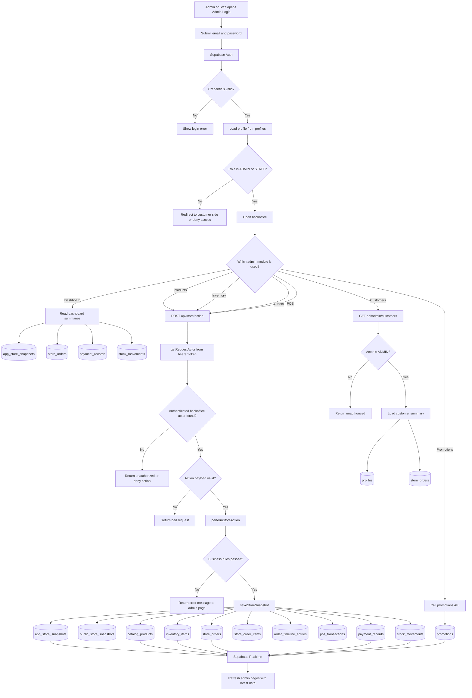

# Admin Diagram

```mermaid
flowchart TD
    A[Admin or Staff opens Admin Login] --> B[Submit email and password]
    B --> C[Supabase Auth]
    C --> D{Credentials valid?}
    D -- No --> E[Show login error]
    D -- Yes --> F[Load profile from profiles]
    F --> G{Role is ADMIN or STAFF?}
    G -- No --> H[Redirect to customer side or deny access]
    G -- Yes --> I[Open backoffice]

    I --> J{Which admin module is used?}

    J -- Dashboard --> K[Read dashboard summaries]
    K --> K1[(app_store_snapshots)]
    K --> K2[(store_orders)]
    K --> K3[(payment_records)]
    K --> K4[(stock_movements)]

    J -- Products --> L[POST api/store/action]
    J -- Inventory --> L
    J -- Orders --> L
    J -- POS --> L
    L --> M[getRequestActor from bearer token]
    M --> N{Authenticated backoffice actor found?}
    N -- No --> O[Return unauthorized or deny action]
    N -- Yes --> P{Action payload valid?}
    P -- No --> Q[Return bad request]
    P -- Yes --> R[performStoreAction]
    R --> S{Business rules passed?}
    S -- No --> T[Return error message to admin page]
    S -- Yes --> U[saveStoreSnapshot]

    U --> V[(app_store_snapshots)]
    U --> W[(public_store_snapshots)]
    U --> X[(catalog_products)]
    U --> Y[(inventory_items)]
    U --> Z[(store_orders)]
    U --> AA[(store_order_items)]
    U --> AB[(order_timeline_entries)]
    U --> AC[(pos_transactions)]
    U --> AD[(payment_records)]
    U --> AE[(stock_movements)]

    J -- Promotions --> AF[Call promotions API]
    AF --> AG[(promotions)]

    J -- Customers --> AH[GET api/admin/customers]
    AH --> AI{Actor is ADMIN?}
    AI -- No --> AJ[Return unauthorized]
    AI -- Yes --> AK[Load customer summary]
    AK --> AL[(profiles)]
    AK --> AM[(store_orders)]

    V --> AN[Supabase Realtime]
    X --> AN
    Y --> AN
    Z --> AN
    AD --> AN
    AE --> AN
    AG --> AN
    AN --> AO[Refresh admin pages with latest data]
```
