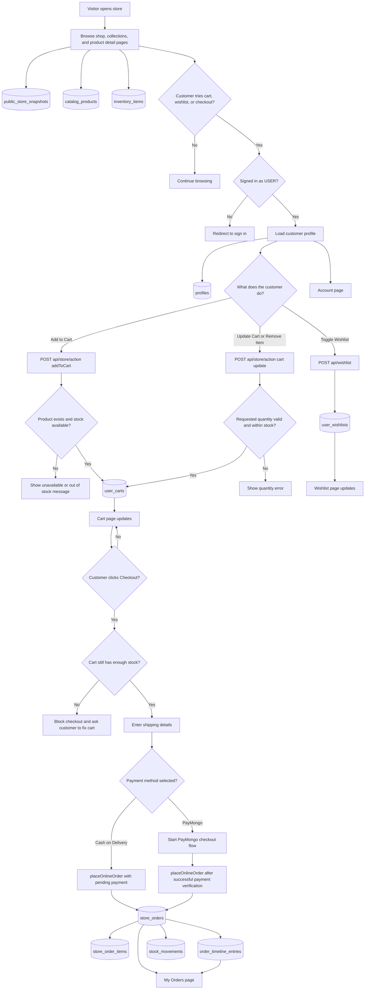

# Customer Diagram

```mermaid
flowchart TD
    A[Visitor opens store] --> B[Browse shop, collections, and product detail pages]
    B --> C[(public_store_snapshots)]
    B --> D[(catalog_products)]
    B --> E[(inventory_items)]

    B --> F{Customer tries cart, wishlist, or checkout?}
    F -- No --> G[Continue browsing]
    F -- Yes --> H{Signed in as USER?}
    H -- No --> I[Redirect to sign in]
    H -- Yes --> J[Load customer profile]
    J --> K[(profiles)]

    J --> L{What does the customer do?}

    L -- Add to Cart --> M[POST api/store/action addToCart]
    M --> N{Product exists and stock available?}
    N -- No --> O[Show unavailable or out of stock message]
    N -- Yes --> P[(user_carts)]
    P --> Q[Cart page updates]

    L -- Update Cart or Remove Item --> R[POST api/store/action cart update]
    R --> S{Requested quantity valid and within stock?}
    S -- No --> T[Show quantity error]
    S -- Yes --> P

    L -- Toggle Wishlist --> U[POST api/wishlist]
    U --> V[(user_wishlists)]
    V --> W[Wishlist page updates]

    Q --> X{Customer clicks Checkout?}
    X -- No --> Q
    X -- Yes --> Y{Cart still has enough stock?}
    Y -- No --> Z[Block checkout and ask customer to fix cart]
    Y -- Yes --> AA[Enter shipping details]
    AA --> AB{Payment method selected?}
    AB -- PayMongo --> AC[Start PayMongo checkout flow]
    AB -- Cash on Delivery --> AD[placeOnlineOrder with pending payment]
    AC --> AE[placeOnlineOrder after successful payment verification]

    AD --> AF[(store_orders)]
    AE --> AF
    AF --> AG[(store_order_items)]
    AF --> AH[(order_timeline_entries)]
    AF --> AI[(stock_movements)]
    AF --> AJ[My Orders page]
    AH --> AJ
    J --> AK[Account page]
```
