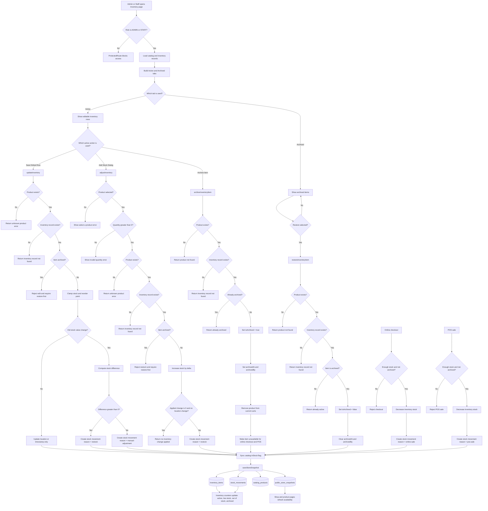

# Inventory Diagram

```mermaid
flowchart TD
    A[Admin or Staff opens Inventory page] --> B{Role is ADMIN or STAFF?}
    B -- No --> C[ProtectedRoute blocks access]
    B -- Yes --> D[Load catalog and inventory records]
    D --> E[Build Active and Archived tabs]
    E --> F{Which tab is used?}
    F -- Active --> G[Show editable inventory rows]
    F -- Archived --> H[Show archived items]

    G --> I{Which active action is used?}

    I -- Save Edited Row --> J[updateInventory]
    J --> K{Product exists?}
    K -- No --> K1[Return unknown product error]
    K -- Yes --> L{Inventory record exists?}
    L -- No --> L1[Return inventory record not found]
    L -- Yes --> M{Item archived?}
    M -- Yes --> M1[Reject edit and require restore first]
    M -- No --> N[Clamp stock and reorder point]
    N --> O{Did stock value change?}
    O -- No --> P[Update location or timestamp only]
    O -- Yes --> Q[Compute stock difference]
    Q --> R{Difference greater than 0?}
    R -- Yes --> S[Create stock movement reason = restock]
    R -- No --> T[Create stock movement reason = manual-adjustment]
    P --> U[Sync catalog inStock flag]
    S --> U
    T --> U

    I -- Add Stock Dialog --> V[adjustInventory]
    V --> W{Product selected?}
    W -- No --> W1[Show select a product error]
    W -- Yes --> X{Quantity greater than 0?}
    X -- No --> X1[Show invalid quantity error]
    X -- Yes --> X2{Product exists?}
    X2 -- No --> X3[Return unknown product error]
    X2 -- Yes --> Y{Inventory record exists?}
    Y -- No --> Y2[Return inventory record not found]
    Y -- Yes --> Z{Item archived?}
    Z -- Yes --> Z1[Reject restock and require restore first]
    Z -- No --> AA[Increase stock by delta]
    AA --> AB{Applied change is 0 and no location change?}
    AB -- Yes --> AB1[Return no inventory change applied]
    AB -- No --> AC[Create stock movement reason = restock]
    AC --> U

    I -- Archive Item --> AD[archiveInventoryItem]
    AD --> AE{Product exists?}
    AE -- No --> AE1[Return product not found]
    AE -- Yes --> AF{Inventory record exists?}
    AF -- No --> AF1[Return inventory record not found]
    AF -- Yes --> AG{Already archived?}
    AG -- Yes --> AG1[Return already archived]
    AG -- No --> AH[Set isArchived = true]
    AH --> AI[Set archivedAt and archivedBy]
    AI --> AJ[Remove product from current carts]
    AJ --> AK[Make item unavailable for online checkout and POS]
    AK --> U

    H --> AL{Restore selected?}
    AL -- No --> H
    AL -- Yes --> AM[restoreInventoryItem]
    AM --> AN{Product exists?}
    AN -- No --> AN1[Return product not found]
    AN -- Yes --> AO{Inventory record exists?}
    AO -- No --> AO1[Return inventory record not found]
    AO -- Yes --> AP{Item is archived?}
    AP -- No --> AP1[Return already active]
    AP -- Yes --> AQ[Set isArchived = false]
    AQ --> AR[Clear archivedAt and archivedBy]
    AR --> U

    AS[Online checkout] --> AT{Enough stock and not archived?}
    AT -- No --> AU[Reject checkout]
    AT -- Yes --> AV[Decrease inventory stock]
    AV --> AW[Create stock movement reason = online-sale]
    AW --> U

    AX[POS sale] --> AY{Enough stock and not archived?}
    AY -- No --> AZ[Reject POS sale]
    AY -- Yes --> BA[Decrease inventory stock]
    BA --> BB[Create stock movement reason = pos-sale]
    BB --> U

    U --> BC[saveStoreSnapshot]
    BC --> BD[(inventory_items)]
    BC --> BE[(stock_movements)]
    BC --> BF[(catalog_products)]
    BC --> BG[(public_store_snapshots)]
    BD --> BH[Inventory counters update: active, low stock, out of stock, archived]
    BE --> BH
    BG --> BI[Shop and product pages refresh availability]
```
