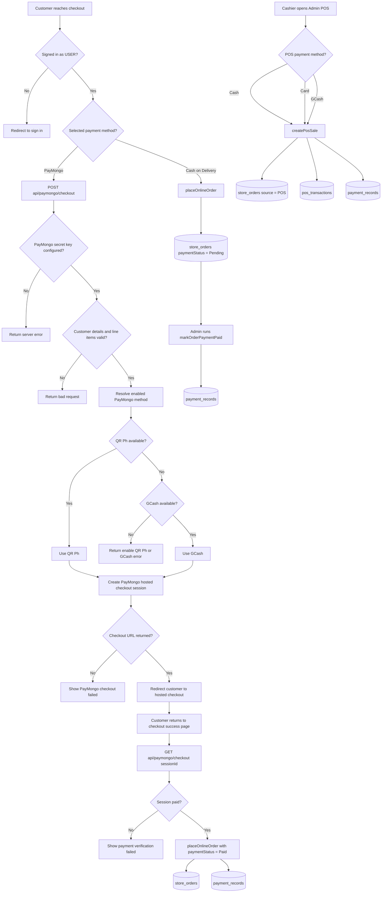

# Payment Method Diagram

```mermaid
flowchart TD
    A[Customer reaches checkout] --> B{Signed in as USER?}
    B -- No --> C[Redirect to sign in]
    B -- Yes --> D{Selected payment method?}

    D -- PayMongo --> E[POST api/paymongo/checkout]
    E --> F{PayMongo secret key configured?}
    F -- No --> G[Return server error]
    F -- Yes --> H{Customer details and line items valid?}
    H -- No --> I[Return bad request]
    H -- Yes --> J[Resolve enabled PayMongo method]
    J --> K{QR Ph available?}
    K -- Yes --> L[Use QR Ph]
    K -- No --> M{GCash available?}
    M -- No --> N[Return enable QR Ph or GCash error]
    M -- Yes --> O[Use GCash]
    L --> P[Create PayMongo hosted checkout session]
    O --> P
    P --> Q{Checkout URL returned?}
    Q -- No --> R[Show PayMongo checkout failed]
    Q -- Yes --> S[Redirect customer to hosted checkout]
    S --> T[Customer returns to checkout success page]
    T --> U[GET api/paymongo/checkout sessionId]
    U --> V{Session paid?}
    V -- No --> W[Show payment verification failed]
    V -- Yes --> X[placeOnlineOrder with paymentStatus = Paid]
    X --> Y[(store_orders)]
    X --> Z[(payment_records)]

    D -- Cash on Delivery --> AA[placeOnlineOrder]
    AA --> AB[(store_orders paymentStatus = Pending)]
    AB --> AC[Admin runs markOrderPaymentPaid]
    AC --> AD[(payment_records)]

    AE[Cashier opens Admin POS] --> AF{POS payment method?}
    AF -- Cash --> AG[createPosSale]
    AF -- Card --> AG
    AF -- GCash --> AG
    AG --> AH[(store_orders source = POS)]
    AG --> AI[(pos_transactions)]
    AG --> AJ[(payment_records)]
```
