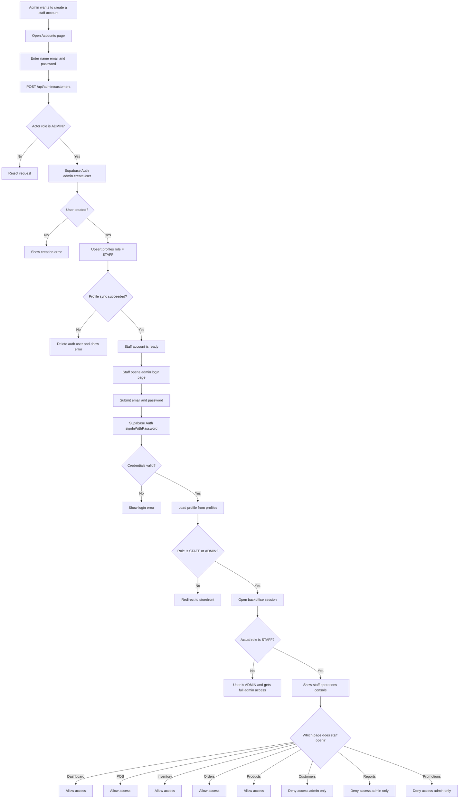

# Staff Account Diagram

```mermaid
flowchart TD
    A[Admin wants to create a staff account] --> B[Open Accounts page]
    B --> C[Enter name email and password]
    C --> D[POST /api/admin/customers]
    D --> E{Actor role is ADMIN?}
    E -- No --> F[Reject request]
    E -- Yes --> G[Supabase Auth admin.createUser]
    G --> H{User created?}
    H -- No --> I[Show creation error]
    H -- Yes --> J[Upsert profiles role = STAFF]
    J --> K{Profile sync succeeded?}
    K -- No --> L[Delete auth user and show error]
    K -- Yes --> M[Staff account is ready]

    M --> N[Staff opens admin login page]
    N --> O[Submit email and password]
    O --> P[Supabase Auth signInWithPassword]
    P --> Q{Credentials valid?}
    Q -- No --> R[Show login error]
    Q -- Yes --> S[Load profile from profiles]
    S --> T{Role is STAFF or ADMIN?}
    T -- No --> U[Redirect to storefront]
    T -- Yes --> V[Open backoffice session]

    V --> W{Actual role is STAFF?}
    W -- No --> X[User is ADMIN and gets full admin access]
    W -- Yes --> Y[Show staff operations console]

    Y --> Z{Which page does staff open?}
    Z -- Dashboard --> AA[Allow access]
    Z -- POS --> AB[Allow access]
    Z -- Inventory --> AC[Allow access]
    Z -- Orders --> AD[Allow access]
    Z -- Products --> AE[Allow access]
    Z -- Customers --> AF[Deny access admin only]
    Z -- Reports --> AG[Deny access admin only]
    Z -- Promotions --> AH[Deny access admin only]
```
